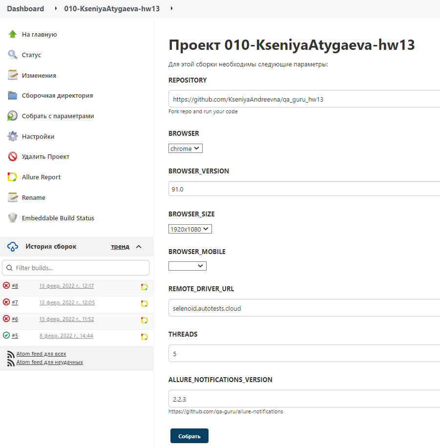
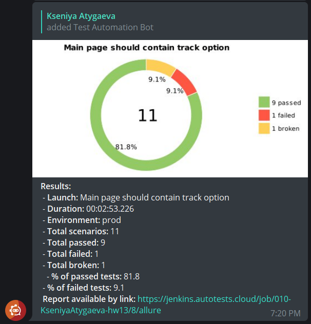
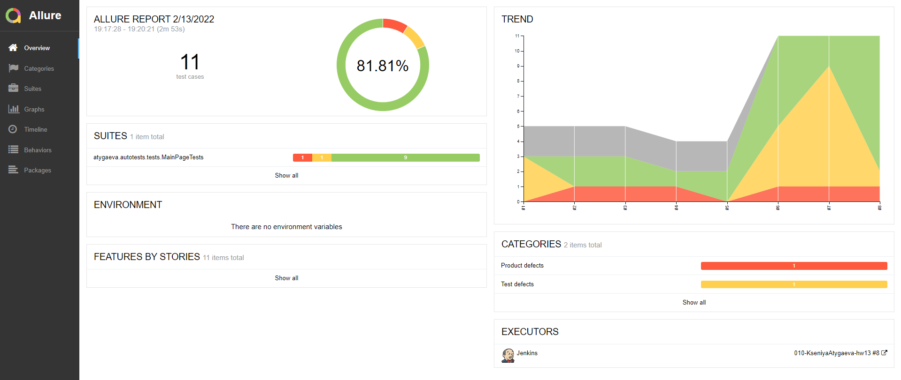

# Автотесты для сайта Почты России


##Используемые технологии и инструменты


# Джоба в Jenkins 
<a target="_blank" href="jenkins.autotests.cloud/job/010-KseniyaAtygaeva-hw13">jenkins.autotests.cloud/job/010-KseniyaAtygaeva-hw13</a>

### Используемые параметры по умолчанию



* browser (default chrome)
* browserVersion (default 91.0)
* browserSize (default 1920x1080)
* browserMobileView (mobile device name, for example iPhone X)
* remoteDriverUrl (url address from selenoid or grid)
* videoStorage (url address where you should get video)
* threads (number of threads)

## Локальный запуск:
```bash
gradle clean test
```

##Удаленный запуск:
```bash
gradle clean -DremoteDriverUrl=https://%s:%s@selenoid.autotests.cloud/wd/hub/ -DvideoStorage=https://selenoid.autotests.cloud/video/ -Dthreads=1 test
```
___
## После прохождения тестов приходит оповещение в Telegram через бот 

#### После прохождения всех тестов, приходит отчет в канал в телеграме:


---
## Анализ результатов
Ссылку на отчет Allure можно найти в 
* Сообщении Telegram
* В последней сборке Jenkins

Allure report (пример):
<a target="_blank" href="https://jenkins.autotests.cloud/job/010-KseniyaAtygaeva-hw13/8/allure/">https://jenkins.autotests.cloud/job/010-KseniyaAtygaeva-hw13/8/allure/</a>


---
### Пример видео прохождения теста, прикрепляется к Allure отчету после каждого прохождения теста


